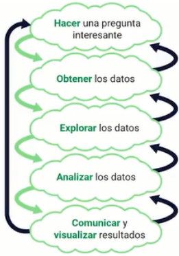

# DATA SCIENCE

[Version en notion](https://www.notion.so/DATA-SCIENCE-30ee68a4128a45a0a030a94be62d33f7) 

- GENERALIDADES
    
    ¿Qué es data Science?: es el proceso de descubrir información valiosa de los datos.
    
    La ciencia de datos es una intervención de conocimientos: matemáticas y estadística, ciencias computacionales, conocimiento del dominio.
    
    ¿Cuál es su finalidad?:
    
    1. Tomar decisiones y crear estrategias de negocio
    2. Crear productos de software más inteligentes y funcionales.
    
    Pasos:
    
    1. Obtención de los datos.
    2. Transformar y limpiar los datos. Muchas veces estarán incorrectos o con formato incompleto
    3. Explorar, analizar y visualizar datos para poder hallar patrones o tendencias y obtener los insight.
    4. Usar modelos de machine learning (no siempre es necesario usarla) para poder predecir información.
    5. Integrar datos de IA a productos de software. Con esto se presenta la información al cliente.
    
    Proceso de la ciencia de datos:
    
    
    
    el proceso entre proyecto a proyecto cambia poco. Es el proceso del método científico llevado al uso de datos.
    
    Inteligencia artificial: Inteligencia artificial (A.I. por sus siglas en inglés) se trata de enseñarles a las máquinas a emular o imitar la inteligencia natural de los seres humanos.
    
    Esto lo hacen por medio de algoritmos que modelan cómo aprendemos, tomamos decisiones e identificamos patrones (emular nuestra inteligencia natural y reconoce patrones en grandes cantidades de datos). Algunos ejemplos son: identificar gatitos de perritos o jugar videojuegos.
    
    Una de las grandes hazañas que ha podido lograr la inteligencia artificial fue ganarle a campeones mundiales en Go (alphaGo), Ajedrez y League of Legends por nombrar algunos. Por supuesto, no fue la misma máquina.
    
    Además, una aclaración importante es que la inteligencia artificial está limitada de cierto modo, porque no puede tener consciencia de sí misma y por ende no puede tomar sus propias decisiones.
    
    Machine learning: Es una rama de la inteligencia artificial, que tiene como objetivo hacer que las computadoras aprendan determinada habilidad.
    
    
    
    Esto se hace por medio de pasarle muchos datos a un algoritmo, que posteriormente nos va a arrojar un modelo, el cual podrá resolver problemas por medio de predicciones que este haga o también implementarlo a un software para solucionar determinadas situaciones.
    
    Se separan los datos en datos de entrenamiento y datos de entrada (que no son los mismos, aunque pueden ser tomados de la misma fuente), que se los pasamos al algoritmo de ML con los cuales se entrena (aprende, reconoce tendencias, etc) para que al final nos arroje un modelo con el podemos resolver problemas, después a este modelo le pasamo los datos de entrada y con esto vamos a empezar a resolver problemas generando una predicción sobre estos datos en el futuro; entonces este modelo lo podemos ir evaluando para ver que tan buena y precisa es esta predicción.
    
    
    
    Datos de entrenamiento: Son los datos utilizados para entrenar un algoritmo y obtener un modelo que pueda hacer predicciones para resolver problemas e implementarse en un software para un mejor rendimiento en el negocio.
    
    Datos de entrada: Son los datos que se le dan al modelo obtenido luego de ser entrenado, que son del mismo contexto que los de entrenamiento, pero con diferentes detalles (no son los mismos que los datos de entrenamiento). Para los cuales va a generar predicciones que serán evaluadas para garantizar la eficacia del modelo.
    
    Utilidad del machine learning: Por ejemplo, si queremos saber cuándo tendremos una pérdida masiva de clientes, podríamos hacer un modelo que haga dicha predicción. Además, saber cuándo y qué producto ofrecerles para no perder un cliente.
    
    Por otra parte, si queremos saber si un paciente es propenso a una enfermedad específica en el futuro, podemos hacer un modelo que realice una predicción para detectar dicha enfermedad en las primeras etapas o prevenirla.
    
    Proceso de integración del machine learning al producto: Hay equipos encargados de implementar modelos de Machine Learning al producto, como por ejemplo: el algoritmo de recomendaciones de Netflix o YouTube, quienes por medio de los datos que el usuario crea al interactuar con la plataforma, predice cuáles son los videos que más podrían interesarle.
    
    Los pasos para la integración del Machine Learning al producto son:
    
    1. Ingesta de datos
    2. Validación de los datos
    3. Preparación de datos
    4. Entrenamiento de modelo
    5. Evaluación de modelo
    6. Validación de modelo
    7. Despliegue de modelo
    8. Interfaz de usuario
    
    Diferencia entre Data Science e inteligencia artificial: Data Science es el proceso para analizar datos y generar predicciones valiosas para la toma de decisiones y creación de productos con datos. La inteligencia artificial se refiere a los algoritmos que sirven para predecir eventos en el futuro, imitando la inteligencia humana (emulan cognición).
    
    Relación entre Data Science e inteligencia artificial: En Data Science se utiliza como herramienta la inteligencia artificial para predecir el futuro, por medio de modelos evaluados que hacen pronósticos, emulando cierta habilidad del ser humano, al analizar grandes cantidades de datos.
    
    Finalmente, podemos decir que la inteligencia artificial se refiere a las máquinas emulando la cognición humana y su principal diferencia es que es una herramienta que es utilizada en el proceso de Data Science para encontrar información valiosa.
    
- BIG DATA
    
    Big Data es una grandísima cantidad de datos que tiene una empresa u organización para trabajar, estos datos generalmente no se pueden manejar o procesar de manera tradicional, debido a su enorme tamaño.
    
    5 V’s del Big data: Para que los datos sean considerados Big Data deben cumplir con las 5 V’s del Big Data, que son las siguientes:
    
    - Volumen: Son toda la cantidad de datos que tiene la empresa, desde su funcionamiento hasta las interacciones de los usuarios. El almacenamiento de la masiva cantidad de datos que pueden ser recolectados de múltiples fuentes.
    - Velocidad: Se refiere a que los datos de Big Data deben tener una velocidad en vivo gracias a las interacciones con las fuentes mencionadas, para poder procesar de manera adecuada, considerando su tamaño.
    - Variedad: Los datos que almacene o transaccione la empresa tienen distintos tipos de formatos. Todo tipo de datos, ya sea estructurados o no estructurados. Podrían ser tablas, texto, imágenes, videos, audios, bases de datos, etc.
    - Veracidad: Los datos que se tengan en Big Data deben ser confiables o verdaderos y de calidad, porque en ellos se basarán importantes decisiones del negocio.
    - Valor: Estos datos que se almacenan deben brindar algún tipo de ventaja o valor a la empresa para tomar decisiones o hacer productos para sus consumidores.
    
    Procesamiento del Big Data: El almacenamiento, transformación, análisis e implementación de estos datos del negocio deben hacerse en distintas computadoras, debido a la gran cantidad y también a las diferentes estrategias que deben utilizarse para que funcione el Big Data.
    
    Algunos servicios que se encargan de dividir este gran problema en partes más pequeñas son: Spark, Hadoop y servicios de cómputo en la nube.
    
    Relación entre Data Science, inteligencia artificial y Big Data: En el procedimiento de búsqueda de información valiosa que es encargado a la Data Science, se usa Big Data para aumentar las posibilidades de tener información más profunda y detallada del negocio.
    
    Además, se pueden emplear modelos entrenados de la rama de Machine Learning de inteligencia artificial para agilizar y encontrar patrones inesperados.
    
    De todo lo anterior se desprende que la Big Data es el concepto que se relaciona cuando una empresa tiene muchísimos datos y la forma de determinarlo es por medio de las 5v’s.
    
    
    
- ¿QUÉ NO ES DATA SCIENCE? ¿POR QUÉ APRENDERLA?
    
    Para conocer el panorama completo sobre lo que es Data Science, debemos saber que definitivamente no es inteligencia artificial, meras matemáticas, archivos de Excel o puras métricas, como a veces se piensa.
    
    - Inteligencia artificial: Esta es solamente una herramienta utilizada por la Data Science, pero no es equivalente o igual.
    - Solo matemáticas: Las matemáticas son empleadas para crear fórmulas e interpretar los datos de la organización, pero no es la única herramienta usada para encontrar información de valor.
    - Solo archivos de Excel: Este es solo uno de los diferentes tipos de archivo que se deben conocer y emplear en Data Science.
    - Solo métricas: Las métricas son una de las herramientas para generar un panorama o contexto de la empresa, pero estas tienen trabajo e interpretación que deben ser brindadas por la Data Science, por medio de otras herramientas.
    
    Por qué no aprender Data Science: Dentro de la Data Science existen muchas actividades que no son del todo agradables o pomposas, pero que son necesarias para lograr un buen resultado.
    
    - No te gusta aprender constantemente: En este ambiente de Data-Driven en que viven las empresas, constantemente se producen nuevas tecnologías para hacer más fáciles o sencillos los procesos en Data, por lo que se debe estar dispuesto y listo para aprender nuevas tecnologías que nos ayuden a encontrar información valiosa para el negocio.
    - No te gusta el trabajo sucio: Dentro del mundo de Data Science, una gran parte del trabajo consiste en borrar, editar, corregir distintos tipos de errores dentro de los datos, para que estos sean los más precisos y veraces posibles.
    - No te gusta ayudar en las demás áreas del negocio: El rol de la Data Science debe ayudar a las demás áreas del negocio, proporcionándoles información relevante para mejorar o verificar distintos procesos dentro de sus funciones para la mejora, eficiencia y eficacia de la empresa.
    - No te gusta hacer que las cosas pasen: La Data Science debe comunicar e influenciar los comportamientos de las demás áreas del negocio para obtener mejores resultados que afecten positivamente a la compañía.
    
    Por qué aprender Data Science:
    
    - Te gusta tomar decisiones basadas en datos: Data-Driven, es la cultura que caracteriza a las empresas que basan sus decisiones en los datos. En estas empresas podrás encontrar grandes oportunidades para buscar y encontrar información super interesante acerca del sector de negocio, y deberás proporcionar posibles acciones a tomar para aprovechar dicha información.
    - Te gusta aplicar matemática y algoritmos: Los algoritmos y las matemáticas son una de las herramientas principales para analizar los datos y exprimirles toda la información valiosa que tengan, de tal modo que deberás aplicarlos.
    - Te gustaría crear productos fuertemente basados en IA: Una de las grandes funciones de la Data Science para buscar información de valor para el negocio, es a través de la A.I. Esto se logra mediante el entrenamiento de modelos para que las A.I. encuentren patrones inesperados dentro de los datos, que ayuden a mejorar los productos existentes, o crear nuevos que satisfagan las necesidades de los clientes. Para dedicarse profesionalmente a la ciencia de datos se requieren algunas habilidades blandas.
    
    En síntesis, Data Science no es una herramienta, sino un conjunto de las mismas, que se combinan en un proceso, para la búsqueda de información valiosa para el negocio. Deberías aprenderla porque es una forma muy poderosa de ayudar a los proyectos, startups y compañías a tomar decisiones y crear productos de alto impacto.
    
- ÁREAS DE APLICACIÓN DE DATA SCIENCE E IA
    
    Dentro de la inteligencia artificial y Data Science nos encontramos con muchas áreas y ramas en las cuales se puede profundizar, como el Machine Learning, el Deep Learning o la robótica, entre otros.
    
    Ramas de la IA: Los distintos campos en que se divide la inteligencia artificial se pueden apreciar de la siguiente manera, cada una con su propio encanto:
    
    - Machine Learning
    - Deep Learning: Es una subrama del machine learning que a través de algoritmos basados en redes neuronales permitirán imitar el comportamiento humano. por ejemplo, aprendizaje supervisado y no supervisado y semi supervisado.
    - RPA (Robotic Process Automation)
    - Visión artificial: podemos analizar y procesar imágenes incluso en tiempo real a través de diversas cámaras web, por ejemplo.
    - Procesamiento del lenguaje natural: por ejemplo, las subsistentes virtuales
    - Robótica: permite combinar todo el software con el hardware, por ejemplo, los robots en minerías que pueden inspeccionar donde hay fugas o fallas
    
    Áreas de Data Science: En este punto es muy importante resaltar que los siguientes ejemplos sobre la aplicación de Data Science son solamente algunos de los muchos que existen.
    
    - Salud: podemos encontrar modelos que ayudan a la detección temprana de enfermedades.
    - Procesos de producción: por ejemplo, la optimización de las cadenas de abastecimientos.
    - Procesos comerciales: por ejemplo, marketing, para determinar nuestro pricing.
    - Redes sociales: análisis de sentimientos, identificación de noticias falsas, por ejemplo.
    
    En definitiva, la industria de Data Science e inteligencia artificial tiene una gama tan amplia de áreas de aplicación que es muy seguro que encuentres una que se alinee con tus gustos e intereses.
    
- ROLES EN LA INDUSTRIA: CÓMO FUNCIONAN LOS EQUIPOS DE DATOS E INTELIGENCIA ARTIFICIAL
    
    Dentro de la industria de Data Science existen varios roles diferenciados, pero esto no siempre fue de esta forma. En el pasado las empresas usaban el término Data Scientist para la persona que se encargaba de todas las tareas de datos en general.
    
    Con el tiempo se fueron creando nuevos términos para referirse a las personas que se encargaban de ciertos procesos dentro del flujo o proceso de la Data.
    
    Además, dentro de una compañía no se puede iniciar a implementar modelos de Machine Learning en conjunto con el producto sin antes tener una cultura Data-Driven para poderlo hacer. De esta forma se origina la pirámide de las necesidades de Data Science.
    
    Pirámide de necesidades de Data Science: La pirámide de necesidades de Data Science nos explica cuál es el orden de las etapas que las empresas deben seguir para su desarrollo en la cultura Data-Driven.
    
    
    
    Esta nos define que dichas etapas tienen el siguiente orden:
    
    1. Recolección de datos
        1. Instrumentación
        2. Logging (creación de cuentas de los usuarios)
        3. Sensores
        4. Datos externos
        5. Contenido generado por el usuario
    2. Movimiento y almacenamiento: los datos recolectados los vamos a mover de un lugar a otro a través de una infraestructura
        1. Datos confiables
        2. Flujo
        3. Infraestructura
            1. Pipelines
        4. ETL (Extract, Transform, Load)
        5. Datos estructurados (es decir, que ya están organizados o clasificados por alguna estructura estándar)
        6. Datos no estructurados (es decir, que los datos están sueltos por ahí).
    3. Exploración y transformación: ya tenemos datos guardados en una base especial para análisis (base, que son los datos con los que podemos trabajar en una empresa), por lo que viene la etapa 3.
        1. Limpieza.
        2. Detección de anomalías
        3. Preparación
    4. Agregaciones y etiquetado
        1. Estadísticas
        2. Métricas (son como las medidas de una actividad en concreto)
        3. Segmentación
        4. Agregaciones
        5. Características
        6. Entrenamiento de datos
    5. Aprendizaje y optimización: hasta la etapa 4 ya tenemos data science. En la etapa 5 ya empezamos IA
        1. Pruebas A/B
        2. Experimentación
        3. Algoritmos simples ML
        4. Inteligencia artificial
        5. Deep Learning
    
    Roles en la industria Data Science: A las etapas anteriores se les añaden los roles que se van a encargar de hacer las tareas y actividades correspondientes para que los datos sigan su curso. Algunos de estos roles suelen tener un enfoque, ya sea con el negocio o con la ingeniería.
    
    
    
    - Data Engineer: Es la persona encargada de construir y mantener todo el ambiente sobre el que habitarán los datos. Por lo que se encuentra en la base de la pirámide y está más enfocada en la ingeniería.
    - Data Scientist: Este rol se encarga de ejecutar los métodos necesarios e indicados para analizar la etapa actual, como también hacer predicciones del futuro por medio de modelos de Machine Learning, con el fin de encontrar información valiosa para crear estrategias y productos que beneficien al consumidor.
    - Data Analyst: Se encarga de estar en una constante búsqueda de necesidades de información que tengan las distintas áreas del negocio, para poder investigarlas y dar respuesta que sea útil para la resolución de problemas y mejoramiento de procesos. A diferencia del rol de Data Scientist, este solamente analiza el presente.
    - Research Scientist: Es un rol reciente en la industria, que trata sobre servir de traductor de los diferentes hallazgos que se encuentren en el equipo de data, como también a la hora de traducir las necesidades del negocio para el equipo de data.
    - Machine Learning Engineer: Se ocupa de evaluar y dar seguimiento a los modelos de Machine Learning planteados, el rol de Data Scientist, como también de comunicarse con el equipo de developers, para la correcta y eficiente implementación de los modelos y el producto.
    - Developer: El rol se encuentra dentro de un equipo de ingeniería dedicado a desarrollar el producto de la empresa. Ya sea en el backend o en el frontend, debe hacer parte de la implementación de los modelos de Machine Learning con el producto.
    
    De esta manera, queda clara que los roles más importantes en la industria de la Data son:
    
    - Data Engineer
    - Data Scientist
    - Data Analyst
    - Research Scientist
    - ML Engineer (Machine Learning Engineer)
    
    Eso no quita que existan otros aún más especializados, que demanden las empresas con alto desarrollo de la cultura Data-Driven.
    
- ¿QUÉ HACE UN DATA ANALYST?
    
    El objetivo de la Data Analyst es analizar información de valor para ayudar a resolver las necesidades de cada una de las áreas de una organización. La diferencia con la Data Scientist es que nada más se ocupa de analizar el presente.
    
    Es uno de los roles ubicados en la mitad de la pirámide de necesidades de Data Science, el cual aprenderemos a profundidad.
    
    ¿Cómo lo hace?: Este rol encuentra información de valor por medio de la extracción de datos de diversas fuentes y su respectivo análisis, para poder presentarlos de forma sencilla a las demás áreas de la empresa con tableros y gráficos.
    
    El día a día de una Data Analyst: Veremos todas aquellas actividades que se deberán hacer en el día a día de una persona que se dedique profesionalmente a Data Analyst.
    
    - Identificar necesidades de información: La Data Analyst debe estar en la búsqueda de necesidades de información de las demás áreas de negocio para poder hacer una correcta formulación que se pueda responder con datos.
    - Extraer datos de fuentes: Para trabajar con los datos primero es necesario saber dónde están y obtenerlos. Estos por lo general se encuentran en bases de datos, internet, redes sociales, etc.
    - Limpiar y organizar los datos: Los datos no van a venir organizados y listos para analizar. Antes se deben corregir, eliminar o editar los errores, espacios en blanco, columnas repetidas, cambiar de formato y demás características que pongan en peligro el buen análisis de los datos.
    - Analizar los datos: Por medio de la estadística descriptiva, herramientas matemáticas y tecnológicas para filtrar, organizar, recopilar los datos de tal forma que permita identificar patrones o estacionalidades que resulten valiosas para la toma de decisiones frente al problema o pregunta formulada al principio.
    - Comunicar los hallazgos: Una vez encontrados los hallazgos, gracias a las exploraciones y análisis de datos, es indispensable comunicarlos de forma sencilla y con la menor carga cognitiva posible, para la inmediata toma de decisiones y creación de productos si es posible.
    
    Ciclo de trabajo de una Data Analyst: Muy de la mano con las actividades del día a día de una Data Analyst, existe una estructura que se debe mantener e iterar, es decir, repetir varias veces hasta obtener el resultado esperado. Las cuales son:
    
    1. Pregunta o problema
    2. Exploración y contraste de hipótesis
    3. Recopilar información de valor
    4. Crear visualizaciones de la información
    5. Comunicar los hallazgos
    
    Ejemplo: Eres la Data Analyst de un E-commerce de ropa y te piden la explicación de por qué se cayeron las ventas el mes pasado. Debes entonces formular una posible hipótesis.
    
    1. Pregunta o problema -> Pregunta: ¿Por qué se cayeron las ventas el mes pasado? Hipótesis: Probablemente, porque el tiempo de espera de la página web fue demasiado y los usuarios se cansaron de esperar y se fueron.
    2. Exploración y queries -> Queries: Extraer los datos del tiempo de espera de la página web. Analizar: Cómo fue la tendencia en el tiempo.
    3. Recopilar información de valor -> Insight: Resulta que encontramos que sí hubo una subida en el tiempo de espera.
    4. Crear visualizaciones de la información -> Mostrar un gráfico de tendencias donde se pueda apreciar las ventas, el tiempo de espera y cómo fue históricamente.
    5. Comunicar los hallazgos -> Reunirse con las personas que hicieron la consulta, para mostrarles y explicarles el gráfico que evidencia la posible razón de la caída de las ventas el mes pasado.
    
    Roles relacionados: Además de los roles más conocidos dentro de la industria de la Data, existen algunos que se especializan aún más, siendo indispensables en estructuras mucho más grandes y desarrolladas de compañías Data-Driven.
    
    - Business Analyst: Es una persona que tiene un conocimiento más profundo del negocio y está para ayudar a la Data Analyst a identificar las preguntas o casos de negocio.
    - Data Visualization Specialist: Es la persona experta en como diseñar y construir tableros para presentar hallazgos a las demás personas, de manera fácil y sencilla.
    
    Al retomar las ideas anteriores, nos damos cuenta de que los procesos de una Data Analyst van enfocados a resolver las preguntas del negocio de las distintas áreas del mismo. Por medio del ciclo de trabajo anteriormente visto y actividades del rol como:
    
    - Identificar necesidades de información
    - Extraer datos de fuentes
    - Limpiar y organizar los datos
    - Analizar los datos
    - Comunicar los hallazgos
    
    Herramientas y tecnologías para data analysts: Para analizar los datos de manera correcta y eficaz debemos saber utilizar herramientas de Data Analyst que faciliten su manipulación y consulta, como por ejemplo poder obtener la información más relevante para el negocio. Algunas de estas herramientas son:
    
    - SQL y estructuración de los datos
    - Excel y Google sheets
    - Visualización en Power BI y Tableau
    - Estadística descriptiva y probabilidad
    - Python y R)
    - Jupyter notebooks (son plataformas donde podrás escribir código sin preocuparte por instalaciones)
    - Librerías de Python como: NumPy, Pandas y Matplotlib
    
    ¿Cómo empezar el camino de la Data Analyst?: Empezar el camino hacia la maestría en el rol de Data Analyst en definitiva no es fácil, como ninguna otra decisión que tomes. Pero para facilitarte un poco la introducción a este mundo aquí tienes algunos pasos que puedes seguir:
    
    1. Entender cómo es la cultura de datos en las empresas
    2. Aprender sobre consultas en las bases de datos con SQL
    3. Saber sobre Excel y Google sheets, ya que algunas investigaciones no requerirán más tecnología
    4. Profundizar sobre cómo crear buenas visualizaciones
    5. Aprender estadística descriptiva y probabilidad, puesto que ayudarán de gran manera a analizar los datos
    
    Habilidades cruciales para desempeñarse como Data Analyst:
    
    - Curiosidad: Esta es fundamental para poder aprender más sobre diferentes tecnologías, como también para abordar los datos desde distintos puntos de vista que puedan ayudar a encontrar información de valor.
    - Comunicación: El rol de Data Analyst requiere de mucha comunicación con las demás áreas, los stakeholders y los managers. Quienes tendrán muchas dudas acerca del negocio, por lo tanto, tendrás que investigar y comunicar de una forma efectiva los hallazgos, para que estos tomen las mejores decisiones.
    
    ¿Cuál es la diferencia entre Data Analyst y Data Science?: En los inicios de los empleos de Data, el rol más llamativo y que quedó como general por algún tiempo fue Data Science; era el rol que hacía de todo, pero conforme pasó el tiempo, esto cambió y entraron en escena los demás roles. Por lo que la principal diferencia es que en Data Science se utiliza mucho más la Inteligencia Artificial (I.A.) que en Data Analyst.
    
- DATA SCIENCE
    
    ¿Cómo defines el rol de Data Science?: Es un área muy grande, en la cual se usan los datos e información para volverlos útiles para resolver problemas.
    
    ¿Cuáles son las actividades que hace una Data Scientist con frecuencia?: El día a día de una Data Science es diferente dependiendo del proyecto para el cual se esté trabajando, y de acuerdo a ello las habilidades que se utilizan varían. Por ejemplo, algunas generales son:
    
    - Hacer código en Python y obtener retroalimentación lo más rápido posible
    - Reuniones con los diferentes interesados para saber si realmente están dando respuesta a las necesidades de la organización
    - Actualizarse en cuanto a las distintas tecnologías y conocimiento de la industria
    
    ¿Cómo enfrentas trabajar para un nuevo proyecto?: Todo proyecto depende en gran medida del nivel de madurez de la cultura Data-Driven en la que se encuentre la empresa.
    
    Lo primero que hago es realizar un diagnóstico de la misma para saber si es posible y además si es de alto impacto para el negocio o proyecto. Dejando claro que para ello se necesita:
    
    - Presupuesto
    - Tiempo
    - Personas
    - Tecnología
    
    ¿Qué hace un Data Scientist?: Generalmente, la persona que desempeña el rol de Data Scientist se encarga de tomar datos de diversas fuentes y analizarlos. Esto con el objetivo de encontrar información valiosa para el negocio, como también para diseñar modelos de Machine Learning, con el objetivo de tomar mejores decisiones dentro de la organización e incorporar los datos al producto.
    
    Día a día de un Data Scientist: Dentro de la rutina diaria de una Data Scientist, nos encontramos con:
    
    - Extraer, limpiar y analizar los datos de diversas fuentes
    - Diseñar y utilizar modelos de Machine Learning
    - Monitorear la precisión de los datos, para una mejor calidad y confiabilidad
    - Automatizar procesos de recolección y transformación de datos para hacer todo mucho más ágil
    - Crear reportes de información en tableros
    - Implementar modelos al de Machine Learning al producto
    - Incorporar datos a los productos
    
    Diferencia entre Data Scientist y Data Analyst: Estos roles se parecen mucho, pero tienen ciertas diferencias, como por ejemplo Data Scientist se enfoca en analizar datos para producir distintos modelos para predecir el futuro con programación avanzada como P.O.O. (Programación Orientada a Objetos).
    
    Mientras que la Data Analyst se enfoca en responder preguntas de negocio de las demás áreas por medio de análisis de datos del presente con una programación fundamental.
    
    
    
    Para resumir, una Data Scientist usualmente es la encargada de dirigir el equipo de data en sus proyectos. Además de utilizar diversas herramientas para analizar el presente y predecir el futuro en la medida de lo posible, con el fin de encontrar información valiosa para el negocio o proyecto.
    
    Herramientas y tecnologías para Data Scientists: Las herramientas más utilizadas para cumplir con el proceso diario de una Data Scientists son las siguientes:
    
    - Python, R y Paradigma de programación orientada a objetos
    - Librerías de Python: NumPy, Pandas y Matplotlib
    - Jupyter Notebooks
    - SQL y No SQL.
    - Algoritmos y librerías de Machine Learning como: Scikit-learn y TensorFlow
    - Álgebra
    - Estadística descriptiva y estadística inferencial
    - Probabilidad
    - Álgebra lineal
    - Cálculo
    
    Cómo comenzar el camino de Data Scientists:
    
    1. Entender cómo se utilizan los datos, aprender Business Intelligence y cómo es el proceso de datos en las organizaciones
    2. Programar con Python
    3. Saber las principales librerías de procesamiento, análisis y visualización de datos en Python
    4. Conocer las Jupyter Notebooks
    5. Aprender estadística y probabilidad aplicada a Data Science
    6. Crear tus primeros proyectos
- DATA ENGINEER
    
    ¿Qué hace un Data Engineer?: La Data Engineer es la encargada de tomar los datos crudos, pero de valor, para transformarlos, organizarlos y almacenarlos en las bases de datos, por medio de la producción de pipelines ETL, que tienen como objetivo abastecer de materia prima o datos a los demás roles, para que ejecuten su trabajo.
    
    Día a día de una Data Engineer: Los procesos que más se repiten en el rol de una Data Engineer son los siguientes:
    
    - Desarrolla y mantiene pipelines de ETL y bases de datos, para transformar los datos crudos
    - Extraer datos de diferentes fuentes, ya sean internas o externas. Lo importante es que sean de valor para el negocio
    - Transformar los datos crudos para el análisis, ya que estos en su forma original no se pueden analizar
    - Almacenar datos limpios en bases de datos especializadas para el análisis. Debido a que las bases de datos usadas en producción suelen ser OLTP (Online Transactional Processing) y si se hacen análisis en estas se pueden romper. Por lo tanto, los datos se deben transportar a bases de datos OLAP (Online Analytical Processing)
    - Crear automatizaciones para que los datos estén constantemente actualizados
    
    Proceso ETL: Extract, Transform and Load o Extraer, Transformar y Cargar, es uno de los procesos más utilizados para la transformación de los datos, es como el proceso de tomar un diamante en bruto y convertirlo en uno procesado y listo para vender.
    
    
    
    - Extract o extracción: Importar datos de diversas fuentes, ya sea internas como externas, mientras sean de valor para la organización. Estos pueden venir con distintas estructuras y formatos.
    - Transform o transformación: Todos los datos ya recopilados deben de situarse en una estructura común y limpia que facilite su análisis.
    - Load o carga: Luego de que los datos se encuentren limpios, estos deben almacenarse en bases de datos OLAP que faciliten la consulta y análisis de los mismos.
    
    Roles relacionados al Data engineer: Dentro del mundo de la Data hay ciertas variaciones en el rol de Data Engineer, que se enfocan o especializan en ciertas actividades clave para el flujo de datos, como por ejemplo:
    
    - Data Architect: Se encarga de plantear estrategias de datos dentro de la organización, mediante la revisión de estándares de calidad, tratamiento de flujo de los datos y seguridad de estos.
    - Big Data Architect: Trabaja con Big Data, las 5V’s de los datos.
    
    A modo de cierre, diremos que una Data Engineer se encarga de saber dónde está la información valiosa para el negocio, entender las herramientas con las cuales se debe hacer el transporte de los datos y hacer las conexiones para abastecer de información al resto del equipo de Data.
    
    Herramientas y tecnologías para Data Engineers: Para triunfar como Data Engineer, debes conocer y saber utilizar las siguientes herramientas:
    
    - Python y R
    - Linux
    - Bases de ingeniería de software
    - Bases de datos NoSQL y SQL.
    - Jupyter Notebooks y editores de código
    - Automatización y scripting
    - Librerías: Pandas, Dask y Apache Spark
    - Airflow
    - Tecnologías *cloud.
    - Docker.
    - Orquestadores Kubernetes
    - Matemática: estadística descriptiva
    
    ¿Cómo empezar el camino como Data Engineer?:
    
    1. Aprender a programar en Python y bases sólidas de ingeniería de software
    2. Saber cómo automatizar procesos
    3. Entender y aplicar librerías como: Pandas y Apache Spark
    4. Conocer bases de datos SQL y NoSQL
- MACHINE LEARNING ENGINEER
    
    ¿Qué hace una Machine Learning Engineer?: La persona con el rol de Machine Learning Engineer toma los modelos de Machine Learning formulados por la Data Science, para su posterior seguimiento y evaluación. También se encarga de la implementación directamente con el producto, ya que este rol es responsable de mantener actualizados dichos modelos.
    
    El día a día de una machine learning engineer:
    
    - Genera extensivas evaluaciones de métricas de los modelos de Machine Learning
    - Implementa el modelo de Machine Learning a producción
    - Colabora con la Data Science y el equipo de desarrollo del producto
    - Analiza el desempeño de los modelos de Machine Learning
    - Mantiene actualizado el modelo Machine Learning
    
    Para sintetizar, una Machine Learning Engineer hace seguimiento, evaluación y corrección de los modelos planteados por la Data Scientist, y crear producto con los developers, al implementar los modelos de Machine Learning.
    
    Herramientas y tecnologías para Machine Learning Engineer:
    
    - Lenguajes de programación: Python, Java y C++
    - Bases sólidas de ingeniería
    - Jupyter Notebooks
    - Principales librerías de Python: NumPy, Pandas, Matplotlib y Seaborn
    - Principales librerías de Machine Learning: Tensor Flow y Keras
    - Tecnologías para exportar tus proyectos a otras máquinas: Flask, FastAPI, tecnologías cloud, contenedores Doker y Kubernetes
    - Matemáticas: estadística descriptiva e inferencial, probabilidad, álgebra lineal y cálculo
    
    ¿Cómo empezar el camino de Machine Learning Engineer?:
    
    1. Aprender a programar en Python
    2. Fundamentos matemáticos
    3. Frameworks para construir tus primeros modelos
    
    
    
- SOFT SKILLS PARA DATA SCIENCE
    
    Aunque muchas veces pasan desapercibidas, las habilidades blandas son muy importantes para un correcto desempeño en el mundo de la Data. Algunas de estas son:
    
    - Storytelling
    - Inglés
    - Pensamiento crítico
    - Creatividad
    - Hacer que las cosas pasen
    - Asumir responsabilidad de los proyectos que se te encarguen
    - Trabajo en equipo tanto con los miembros de Data, como con los demás miembros de las áreas del negocio
    - Curiosidad